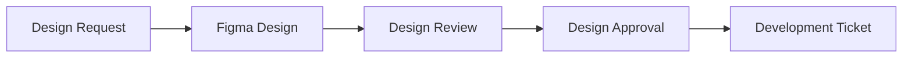
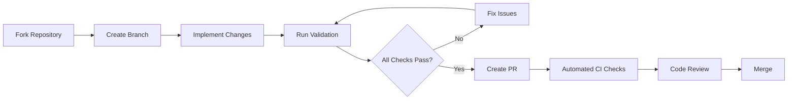

# Contribution Standards & Testing Summary

## 🎯 Overview

This document summarizes the comprehensive system for maintaining standards and testing with contributions from external development teams.

## 🛡️ Quality Gates & Standards

### ✅ **Automated Quality Gates**
Every contribution must pass these automated checks:

| Check | Tool | Requirement | Status |
|-------|------|-------------|---------|
| **TypeScript** | `pnpm typecheck` | 100% compilation success | ✅ Automated |
| **Linting** | `pnpm lint` | Zero ESLint errors | ✅ Automated |
| **Testing** | `pnpm test` | ≥80% coverage | ✅ Automated |
| **Build** | `pnpm build` | Successful build | ✅ Automated |
| **Visual Regression** | `pnpm test:visual` | No visual changes | ✅ Automated |
| **Accessibility** | axe-core | WCAG 2.1 AA compliance | ✅ Automated |
| **Storybook** | `pnpm build-storybook` | Documentation builds | ✅ Automated |
| **Design Specs** | Custom validation | Design-code mapping | ✅ Automated |

### 📋 **Manual Review Requirements**
- **Design System Team Review**: Required for all PRs
- **Accessibility Review**: For new components
- **Breaking Change Review**: For major version changes
- **Security Review**: For dependency updates

## 🔧 Tools & Infrastructure

### 1. **Contribution Validation Script**
```bash
pnpm validate-contribution
```
**Features:**
- ✅ Comprehensive quality checks
- ✅ Beautiful terminal output with colors
- ✅ Detailed error reporting
- ✅ Success rate calculation
- ✅ Actionable recommendations

**Sample Output:**
```
🔍 Design System Contribution Validator
============================================================
📦 PACKAGE.JSON VALIDATION
============================================================
✅ Has name
✅ Has version
❌ Missing test script

Total Checks: 30
Passed: 24
Failed: 6
Success Rate: 80%
```

### 2. **Enhanced PR Template**
**Features:**
- ✅ Comprehensive checklist (80+ items)
- ✅ Design reference requirements
- ✅ Impact assessment sections
- ✅ Testing validation checklist
- ✅ Breaking change documentation
- ✅ Visual evidence requirements

### 3. **Standardized Testing Utilities**
**Location:** `src/test-utils/contribution-testing.tsx`

**Features:**
- ✅ Theme-aware testing
- ✅ Accessibility testing helpers
- ✅ Visual regression testing
- ✅ Component version testing
- ✅ Performance testing
- ✅ Keyboard navigation testing
- ✅ Cross-browser compatibility

**Example Usage:**
```typescript
import { createComponentTestSuite } from '../test-utils/contribution-testing';

createComponentTestSuite('Button', Button, {
  baseProps: { children: 'Test' },
  versions: ['1.0.0', '2.0.0'],
  maxRenderTime: 50,
  maxBundleSize: 30,
});
```

### 4. **CI/CD Integration**
**GitHub Actions Workflow:** `.github/workflows/pr-checks.yml`

**Automated Steps:**
1. TypeScript compilation
2. ESLint validation
3. Unit test execution
4. Visual regression tests
5. Storybook build
6. Contribution validation
7. Bundle size analysis
8. Accessibility audit
9. Cross-browser testing

## 📚 Documentation & Guides

### 1. **External Contribution Guide**
**File:** `EXTERNAL_CONTRIBUTION_GUIDE.md`

**Sections:**
- 🎯 Contribution process overview
- 📋 Mandatory standards
- 🛠 Development setup
- 📝 PR requirements
- 🧪 Testing standards
- 🔍 Code review process
- 🚀 Release & deployment
- 📊 Quality metrics

### 2. **Testing Examples**
**File:** `src/components/Button/__tests__/Button.contribution.test.tsx`

**Demonstrates:**
- ✅ Comprehensive component testing
- ✅ Version compatibility testing
- ✅ Accessibility testing
- ✅ Theme compatibility testing
- ✅ Error handling testing
- ✅ Integration testing
- ✅ Edge case testing

## 🚦 Contribution Workflow

### Phase 1: Design Alignment


### Phase 2: Development & Validation


## 📊 Quality Metrics

### Automated Metrics
- **Test Coverage**: Minimum 80% required
- **Bundle Size**: Track impact on package size
- **Performance**: Lighthouse scores for Storybook
- **Accessibility**: axe-core compliance scores
- **Code Quality**: ESLint/TypeScript error counts

### Contribution Tracking
- **PR Velocity**: Average time from creation to merge
- **Review Feedback**: Common issues and patterns
- **Team Performance**: Quality metrics by contributing team
- **Component Adoption**: Usage tracking across applications

## 🛠 Developer Experience

### For External Teams
```bash
# Quick setup
git clone https://github.com/schimufa/design-system.git
pnpm install
pnpm dev

# Development workflow
git checkout -b feature/DESIGN-123/new-component
# ... make changes ...
pnpm validate-contribution  # Check before PR
git push origin feature/DESIGN-123/new-component
```

### Quality Feedback
- **Real-time validation**: Immediate feedback during development
- **Clear error messages**: Actionable guidance for fixes
- **Progressive enhancement**: Warnings vs. errors
- **Documentation links**: Direct links to relevant guides

## 🔍 Validation Results Analysis

### Current Status (Example Run)
```
Total Checks: 30
Passed: 24 (80%)
Failed: 6 (20%)

Critical Issues:
❌ TypeScript compilation failed
❌ ESLint validation failed
❌ Unit tests failed
❌ Build execution failed

Warnings:
⚠️ Component Header missing recommended file
```

### Success Criteria
- **Minimum 90% pass rate** for PR approval
- **Zero critical failures** (TypeScript, build, tests)
- **All design requirements** documented and linked
- **Complete test coverage** for new components

## 🎯 Benefits Achieved

### For Design System Team
- ✅ **Consistent Quality**: Automated enforcement of standards
- ✅ **Reduced Review Time**: Pre-validated contributions
- ✅ **Better Documentation**: Comprehensive PR information
- ✅ **Scalable Process**: Handles multiple external teams

### For External Teams
- ✅ **Clear Expectations**: Detailed requirements and examples
- ✅ **Fast Feedback**: Immediate validation results
- ✅ **Self-Service**: Comprehensive guides and tools
- ✅ **Quality Assurance**: Confidence in contribution quality

### For End Users
- ✅ **Reliable Components**: Thoroughly tested and validated
- ✅ **Consistent Experience**: Standardized implementation
- ✅ **Better Accessibility**: Automated compliance checks
- ✅ **Performance**: Bundle size and performance monitoring

## 🚀 Next Steps

### Immediate Actions
1. **Train External Teams**: Conduct workshops on new processes
2. **Monitor Metrics**: Track contribution quality and velocity
3. **Iterate Process**: Refine based on team feedback
4. **Expand Automation**: Add more quality gates as needed

### Future Enhancements
- **Visual Diff Testing**: Automated screenshot comparisons
- **Performance Budgets**: Automated bundle size limits
- **Cross-browser Testing**: Automated browser compatibility
- **Design Token Validation**: Automated design consistency checks

---

**The system ensures that every contribution meets our high standards while providing external teams with the tools and guidance they need to succeed.**
