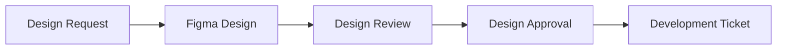
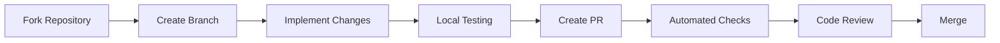

# External Team Contribution Guide

This guide establishes standards and processes for external development teams contributing to the design system.

## 🎯 Overview

Our design system maintains high quality through:
- **Automated quality gates** that prevent substandard code
- **Design-first workflow** ensuring visual consistency
- **Comprehensive testing** covering functionality, accessibility, and visual regression
- **Clear contribution standards** with automated enforcement

## 🚦 Contribution Process

### Phase 1: Design Alignment


### Phase 2: Development & Testing


## 📋 Mandatory Standards

### 1. **Design Requirements**
- ✅ **Figma Design**: All changes must have approved Figma designs
- ✅ **Design Ticket**: Format: `[DESIGN-{number}] Component: Description`
- ✅ **Design Specs**: Updated design-to-code mapping
- ✅ **Visual Compliance**: Pixel-perfect implementation

### 2. **Code Quality Standards**
- ✅ **TypeScript**: 100% type coverage
- ✅ **ESLint**: Zero linting errors
- ✅ **Prettier**: Consistent code formatting
- ✅ **Test Coverage**: Minimum 80% coverage
- ✅ **Build Success**: All packages must build successfully

### 3. **Testing Requirements**
- ✅ **Unit Tests**: Component functionality
- ✅ **Integration Tests**: Component interactions
- ✅ **Visual Regression**: Screenshot comparisons
- ✅ **Accessibility Tests**: WCAG 2.1 AA compliance
- ✅ **Cross-browser Testing**: Chrome, Firefox, Safari, Edge

### 4. **Documentation Standards**
- ✅ **Component Docs**: Props, examples, usage guidelines
- ✅ **Storybook Stories**: Interactive examples
- ✅ **Migration Guides**: For breaking changes
- ✅ **API Documentation**: Generated TypeScript docs

## 🛠 Quality Gates & Automation

### Automated PR Checks
Every pull request triggers automated validation:

```yaml
✅ TypeScript compilation
✅ ESLint validation  
✅ Unit test execution
✅ Coverage threshold check
✅ Visual regression tests
✅ Accessibility audits
✅ Theme validation
✅ Design spec validation
✅ Documentation generation
✅ Storybook build
```

### Manual Review Requirements
- **Design System Team Review**: Required for all PRs
- **Accessibility Review**: For new components
- **Breaking Change Review**: For major version changes
- **Security Review**: For dependency updates

## 🔧 Development Setup for External Teams

### 1. Repository Setup
```bash
# Fork the repository
git clone https://github.com/your-org/design-system.git
cd design-system

# Install dependencies
pnpm install

# Start development environment
pnpm dev
```

### 2. Branch Naming Convention
```bash
# Feature branches
feature/DESIGN-123/button-variant
feature/DESIGN-124/card-enhancement

# Bug fixes
bugfix/DESIGN-125/accessibility-fix
bugfix/DESIGN-126/theme-issue

# Documentation
docs/DESIGN-127/component-guide
```

### 3. Development Workflow
```bash
# 1. Create feature branch
git checkout -b feature/DESIGN-123/new-component

# 2. Implement changes
# - Add component code
# - Add tests
# - Add stories
# - Update docs

# 3. Run quality checks
pnpm lint          # Code linting
pnpm test          # Unit tests
pnpm test:visual   # Visual regression
pnpm build         # Build check
pnpm typecheck     # TypeScript validation

# 4. Create changeset
pnpm changeset     # Document changes

# 5. Commit and push
git add .
git commit -m "feat(component): add new feature [DESIGN-123]"
git push origin feature/DESIGN-123/new-component
```

## 📝 Pull Request Requirements

### PR Template Compliance
All PRs must complete the template sections:

```markdown
## Design Reference ✅
- Figma URL: [Required]
- Design Version: [Required]
- Component(s) Affected: [Required]

## Type of Change ✅
- [ ] Bug fix (non-breaking)
- [ ] New feature (non-breaking)  
- [ ] Breaking change
- [ ] Documentation update

## Testing Checklist ✅
- [ ] Unit tests added/updated
- [ ] Visual regression tests pass
- [ ] Accessibility tests pass
- [ ] Cross-browser testing completed

## Documentation ✅
- [ ] Component documentation updated
- [ ] Storybook stories added/updated
- [ ] Migration guide (if breaking)
```

### Required Artifacts
1. **Screenshots**: Before/after comparisons
2. **Test Results**: Coverage reports
3. **Accessibility Report**: WAVE/axe results
4. **Performance Impact**: Bundle size analysis

## 🧪 Testing Standards

### 1. Unit Testing
```typescript
// Example: Component unit test
describe('Button Component', () => {
  it('renders with correct props', () => {
    render(<Button variant="contained">Test</Button>);
    expect(screen.getByRole('button')).toHaveTextContent('Test');
  });

  it('handles click events', () => {
    const handleClick = jest.fn();
    render(<Button onClick={handleClick}>Click me</Button>);
    fireEvent.click(screen.getByRole('button'));
    expect(handleClick).toHaveBeenCalledTimes(1);
  });

  it('supports different versions', () => {
    render(<Button version="2.0.0">Modern Button</Button>);
    expect(screen.getByRole('button')).toHaveStyle({
      borderRadius: '20px'
    });
  });
});
```

### 2. Visual Regression Testing
```typescript
// Example: Visual regression test
describe('Button Visual Tests', () => {
  it('matches visual snapshot', async () => {
    const component = render(<Button variant="contained">Button</Button>);
    expect(component).toMatchSnapshot();
  });

  it('renders correctly across themes', async () => {
    const themes = ['finance', 'logistics', 'sales'];
    for (const theme of themes) {
      const component = render(
        <ThemeProvider theme={getTheme(theme)}>
          <Button variant="contained">Themed Button</Button>
        </ThemeProvider>
      );
      expect(component).toMatchSnapshot(`button-${theme}-theme`);
    }
  });
});
```

### 3. Accessibility Testing
```typescript
// Example: Accessibility test
describe('Button Accessibility', () => {
  it('has proper ARIA attributes', () => {
    render(<Button aria-label="Submit form">Submit</Button>);
    const button = screen.getByRole('button');
    expect(button).toHaveAttribute('aria-label', 'Submit form');
  });

  it('supports keyboard navigation', () => {
    const handleClick = jest.fn();
    render(<Button onClick={handleClick}>Click me</Button>);
    const button = screen.getByRole('button');
    
    button.focus();
    fireEvent.keyDown(button, { key: 'Enter' });
    expect(handleClick).toHaveBeenCalled();
  });

  it('meets color contrast requirements', async () => {
    const { container } = render(<Button variant="contained">Button</Button>);
    const results = await axe(container);
    expect(results).toHaveNoViolations();
  });
});
```

## 🔍 Code Review Process

### Automated Review Checks
- **Danger.js**: Automated PR feedback
- **CodeClimate**: Code quality analysis  
- **Snyk**: Security vulnerability scanning
- **Bundle Analyzer**: Performance impact assessment

### Human Review Criteria

#### Design System Team Review
- [ ] Design alignment verification
- [ ] Component API consistency
- [ ] Theme integration correctness
- [ ] Documentation completeness

#### Technical Review
- [ ] Code quality and patterns
- [ ] Performance implications
- [ ] Security considerations
- [ ] Backward compatibility

#### Accessibility Review
- [ ] WCAG 2.1 AA compliance
- [ ] Screen reader compatibility
- [ ] Keyboard navigation support
- [ ] Color contrast validation

## 🚀 Release & Deployment

### Contribution Integration
1. **PR Approval**: All checks pass + human approval
2. **Merge to Main**: Automated integration
3. **Version Bump**: Changeset-based versioning
4. **Release Creation**: Automated release process
5. **Documentation Update**: Auto-deployed docs
6. **Team Notification**: Slack/email notifications

### Post-Release Monitoring
- **Usage Analytics**: Component adoption tracking
- **Error Monitoring**: Runtime error detection
- **Performance Metrics**: Bundle size and load times
- **User Feedback**: Issue tracking and resolution

## 📊 Quality Metrics & Reporting

### Automated Metrics
- **Test Coverage**: Minimum 80% required
- **Bundle Size**: Track size impact
- **Performance**: Lighthouse scores
- **Accessibility**: axe-core compliance
- **Code Quality**: ESLint/SonarQube scores

### Contribution Tracking
- **PR Velocity**: Time from creation to merge
- **Review Feedback**: Common issues and patterns
- **Team Performance**: Contribution quality by team
- **Component Adoption**: Usage across applications

## 🆘 Support & Resources

### For External Teams
- **Slack Channel**: #design-system-external
- **Office Hours**: Weekly Q&A sessions
- **Documentation**: Comprehensive guides and examples
- **Training Materials**: Video tutorials and workshops

### Escalation Process
1. **Technical Issues**: Create GitHub issue
2. **Design Questions**: Tag @design-system-team
3. **Urgent Blockers**: Slack #design-system-urgent
4. **Process Questions**: Email design-system@company.com

## 📚 Additional Resources

- **Storybook**: Interactive component documentation
- **Design Specs**: Figma design system file
- **API Documentation**: Generated TypeScript docs
- **Migration Guides**: Version upgrade instructions
- **Best Practices**: Component development guidelines

---

**Remember**: Quality is non-negotiable. Our automated systems ensure every contribution meets our high standards, making the design system reliable for all teams.
